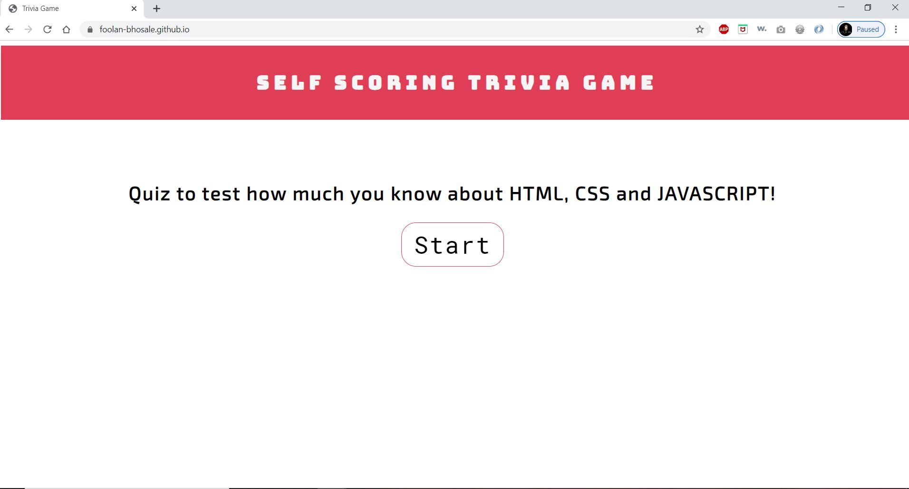
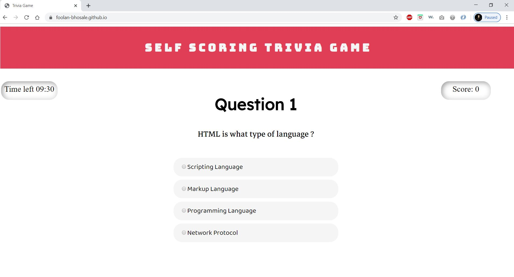

# Trivia Game Quiz

**Description**
Self scoring Trivia quiz application using Html, Css and Javascript.

 
 **Project Screenshots**

**Features**
- Users can test their HTML and CSS knowledge.
- Users can challenge themselves to finish the quiz before the clock times out.

**Technologies Used**
 - HTML
 - CSS
 - JAVASCRIPT DOM

 **Installation Instructions**
 - Fork and clone the repository locally on your system.
 - Install [Visual Studio Code](https://code.visualstudio.com/Download) or any choice of your code editor like atom or bracket.
 - Start up the server using live server extension if you are using VS Code and navigate through the indicated port number.

 **Contribution**
   - Question and answers source.
     - https://www.examtiger.com/.

   -   https://codepen.io/jme11/pen/NWGKMMb?editors=0010

   - https://stackoverflow.com/questions/13154488/giving-dynamic-label-to-a-radio-button

   - https://htmlcolorcodes.com/color-picker/

   - https://www.w3schools.com/

   - https://stackoverflow.com/

   - https://angrytools.com/css/animation/

   - https://css-tricks.com/

 